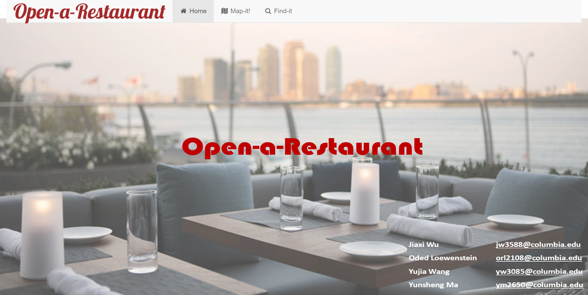
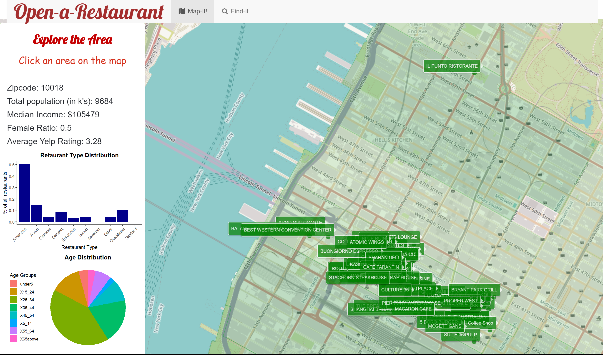
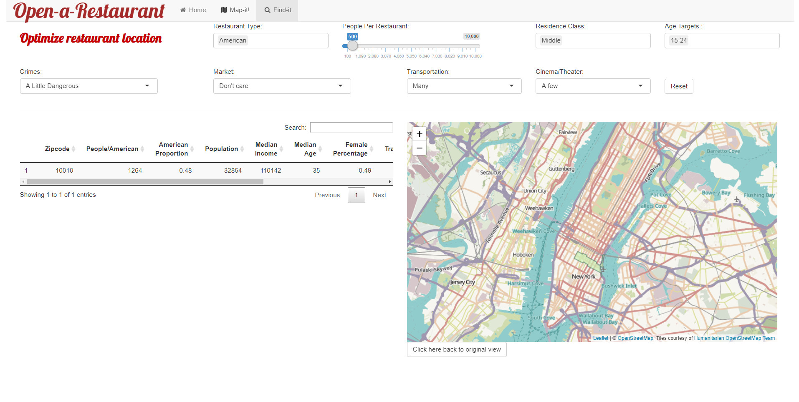

# Project 2: Shiny App Development Version 2.0

### [Project Description](doc/project2_desc.md)



## Open-a-Restaurant
+ **Term**: Fall 2018

+ **Team 3**:
	+ Jiaxi Wu
	+ Oded Loewenstein
	+ Yujia Wang
	+ Yungsheng Ma
	
**Planning to open a restaurant in Manhattan?** 

**Our planner is the perfect way to find the best location for your restaurant? Please try our [app](https://fall2018project2gr3.shinyapps.io/open-a-restuarant/)!**

+ **Project summary**: 
One of the riskiest businesses to open nowadays is the restaurant business. According to a study conducted by the [Perry Group](https://yourbusiness.azcentral.com/average-life-span-restaurant-6024.html), most restaurants close within their first year and 30% close within 5 years. Moreover, private restaurants have much lower success rate than restaurant chains. One of the main reason for this failure is choosing the wrong location. Private restaurant owners lack the resources chains have to optimally choose the location of their restaurant. While many apps provide optimal restaurant choices for the customer side, **Our app intends to provide the required information from the owner's perspective to the potential restaurant owner**

+ **How it works**: 
  Our app has two different features to help future restaurant owners choose the restaurant's location:
  	+ **Map-it!**: 
	a visulization tool of different locations in Manhattan (by zip code) accompanied by location statistics relevant to the future owner's decision process indcluding the restaurant types and the demographic diversification in the area.
	
	
	
	+ **Find it!**:
	a location suggestion tool which allows the future restaurant owner to zone-in on all the areas which are ideal for his restaurant given a set of criterias: restaurant type, the minimal amount of people per this type of restaurants in the area and target clientele of the restaurant, such as socio-economic class and age. After an initial screening, the map highlights the suggested areas and provides a table with relevant information and statistics, and can rank the areas according to the a desired statistic, to gain a full understanding of the pros and cons of each area and optimize his choice.
	


+ **Data Source**: 
 We rely on many data sources mainly collected from [NYC open data]( https://opendata.cityofnewyork.us/) and [U.S. government open data](https://data.gov/).
 
+ **Contribution statement**: 
We had a great experience working together on this project. We feel like the progress of our work was timely and efficient mainly due to great team work. We conducted many group meetings, brain stormed together on each functionality of our app and listened to every team member's thoughts. All team members were highly engaged in each part of this project and conrtibuted equally. After we decided the ideas, Jiaxi and Yunsheng focus on writing the code for two panels. Yujia and Oded focus on finding and cleaning the data as well as combining and polishing the code.

Following [suggestions](http://nicercode.github.io/blog/2013-04-05-projects/) by [RICH FITZJOHN](http://nicercode.github.io/about/#Team) (@richfitz). This folder is orgarnized as follows.

```
proj/
├── app/
├── lib/
├── data/
├── doc/
└── output/
```

Please see each subfolder for a README file.
